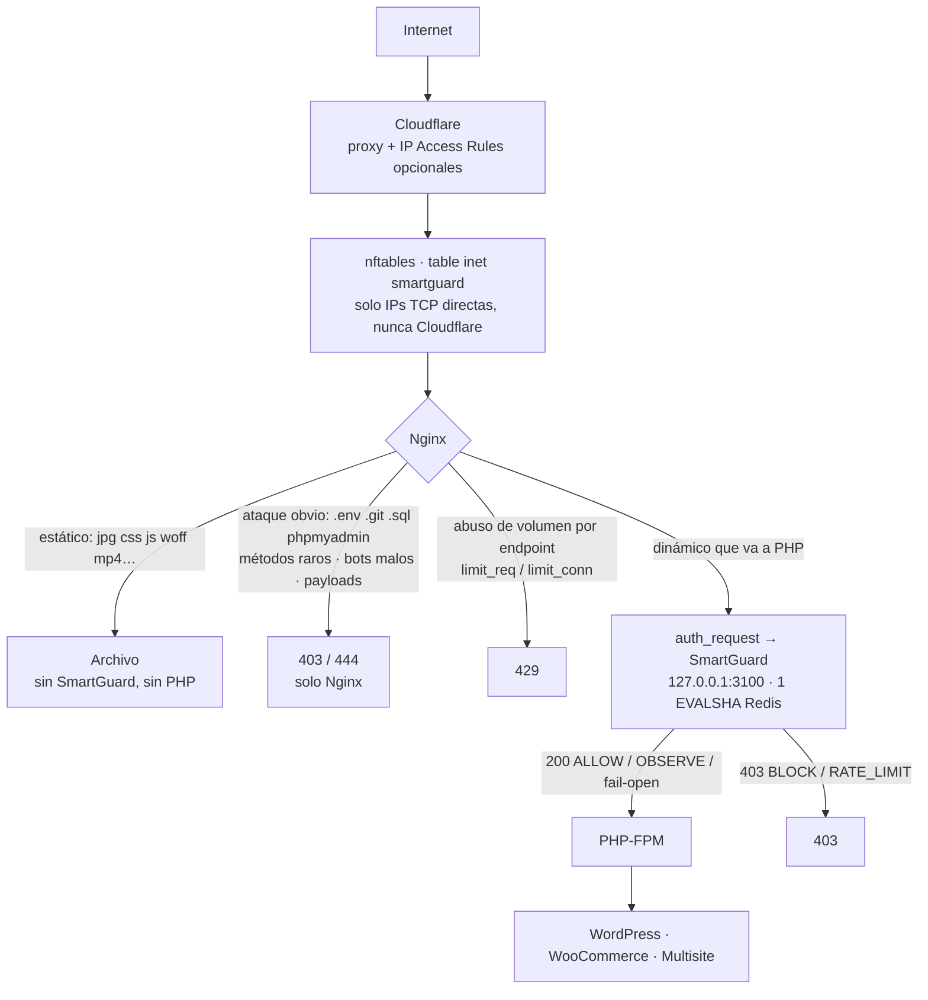
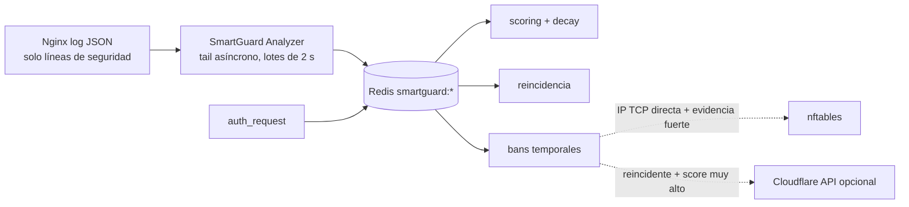

# SmartGuard

[English](README.md) · **Español**

Capa de seguridad para **WordPress, WooCommerce y WordPress Multisite** que detiene el tráfico
malicioso **antes de que consuma PHP-FPM**. Nginx sigue siendo el servidor frontal; SmartGuard
(NestJS + Redis) es el motor de decisión, scoring, reputación y bans, y solo se consulta para
tráfico que iba a PHP.

> Prioridades de diseño, en orden: no romper WooCommerce · no romper Multisite · evitar PHP ·
> evitar falsos positivos · bajo CPU · bajo Redis · fail-open · IPv4+IPv6 · mantenible · auditable.

- Instalación, AUDIT y ENFORCE paso a paso (FASES 13–15): [docs/02-PROCEDIMIENTOS.md](docs/02-PROCEDIMIENTOS.md)

- Instalación con Docker / Docker Compose: [docs/docker.es.md](docs/docker.es.md)
- Todos los comandos: [sección 12](#12-comandos)

---

## 1. Arquitectura





**Por qué `auth_request` solo en las `location` con `fastcgi_pass`:** es el único punto por el que
pasa *todo* lo que llega a PHP-FPM (incluidas las redirecciones internas `try_files … /index.php`),
y nada estático pasa por ahí. Así ningún `.php` directo se salta SmartGuard y ninguna imagen genera
una subpetición.

## 2. Estructura

```
smartguard/
├── src/
│   ├── main.ts / app.module.ts     Bootstrap Fastify, validación global, shutdown ordenado
│   ├── config/                     env tipado + YAML (reglas, sitios, bots)
│   ├── common/                     tipos, IP/CIDR (IPv4/IPv6), URI, logger JSON, guards
│   ├── redis/                      conexión + circuit breaker + scripts Lua
│   ├── reputation/                 almacén Redis y almacén en memoria (misma semántica)
│   ├── rules/                      motor de reglas + protección anti-ReDoS
│   ├── scoring/                    decisión, contexto de petición, modo AUDIT/ENFORCE
│   ├── ban/                        BanService (reincidencia, nftables, Cloudflare)
│   ├── bots/                       verificación FCrDNS (Googlebot, Bingbot, Applebot)
│   ├── whitelist/                  allowlists por tipo
│   ├── firewall/                   nftables sin shell (execFile + validación)
│   ├── cloudflare/                 rangos Cloudflare + API opcional
│   ├── logs/                       tail del log JSON + analizador de comportamiento
│   ├── nginx/                      GET /internal/decision (auth_request)
│   ├── admin/                      API administrativa autenticada
│   ├── dashboard/                  sirve el build del dashboard Angular (CSP + nonce)
│   ├── health/ metrics/ stats/ alerts/
├── config/          rules.yaml · sites.yaml · bots.yaml
├── nginx/           conf.d/smartguard.conf (→ sites-enabled/00-smartguard.conf en CloudPanel) · smartguard/*.conf
├── nftables/        smartguard.nft · origin-lock.nft
├── systemd/         smartguard.service (+ drop-in nftables) · smartguard-nft · timer rangos CF
├── scripts/         install · update · uninstall · rollback-nginx · update-cloudflare-ips ·
│                    origin-lock · test-attacks · loadtest · smartguard-fw-sync · lib/
├── docker/          Imagen de Nginx, plantilla del sitio y ejemplo de .env para Docker Compose
├── Dockerfile · docker-compose.yml
├── dashboard/       Dashboard Angular 22 (standalone, signals, sin zone.js), inglés/español
├── bin/smartguard   CLI
├── logrotate/       smartguard-nginx
├── tests/           unit/ · integration/
└── docs/
```

## 3. Requisitos

| Componente | Versión | Notas |
|---|---|---|
| Debian | 13 | probado para Debian 13 (Trixie) |
| Node.js | ≥ 22 | del sistema (`/usr/bin/node`), no nvm en `/home`. El `nodejs` de apt en Debian 13 es 20.x: el instalador usa NodeSource |
| Nginx | ≥ 1.18 | con `http_auth_request_module` y `http_realip_module`. **Debe existir ya**, con los sitios a proteger |
| Redis | ≥ 6 | opcional en la práctica: sin Redis funciona en memoria (modo degradado) |
| nftables | cualquiera | opcional |

El instalador comprueba todo esto y **instala lo que falte** (curl, tar, openssl, git, redis-tools,
Node 22 y Redis) preguntando antes. Nginx es lo único que no instala.
Con Docker no hace falta nada de esto en el servidor: ver [docs/docker.es.md](docs/docker.es.md).

### Dependencias (y por qué cada una)

| Paquete | Motivo |
|---|---|
| `@nestjs/core`, `@nestjs/common`, `@nestjs/platform-fastify` | Framework pedido; Fastify por menor overhead que Express en el endpoint de decisión |
| `reflect-metadata`, `rxjs` | Dependencias obligatorias de Nest |
| `ioredis` | Cliente Redis mantenido, con `defineCommand` (EVALSHA automático), pipelines, timeouts y backoff |
| `ipaddr.js` | Parsing IPv4/IPv6/CIDR robusto (lo usa también Express); sin dependencias |
| `yaml` | Reglas y sitios en YAML legible; sin dependencias |
| `@prometheus-io/client` | Métricas Prometheus estándar (histogramas correctos). Es el antiguo `prom-client`, ahora mantenido por el proyecto Prometheus; misma API. Exige Node ≥ 22 |

No se usan: class-validator/class-transformer ni clases DTO (la validación son decoradores propios, ver §10), dotenv (systemd `EnvironmentFile=`), axios (fetch nativo), `@nestjs/config`,
`@nestjs/schedule`, `@nestjs/throttler`, helmet (la API es local; el dashboard pone sus cabeceras
de seguridad y CSP con nonce a mano), ORMs ni SQL.

## 4. Instalación y primeros pasos

Para ejecutarlo con Docker Compose, ve a [docs/docker.es.md](docs/docker.es.md).

### 4.1 Instalar

En el servidor, como un usuario con `sudo`:

```bash
sudo apt-get install -y git                       # solo si no tienes git
git clone https://github.com/piero2011/smartguard.git /tmp/smartguard-src
cd /tmp/smartguard-src
sudo ./scripts/install.sh --dry-run               # enseña lo que haría, sin tocar nada
sudo ./scripts/install.sh
```

Qué hace el instalador:

1. **Dependencias.** Si falta algo del sistema lo instala con `apt`, preguntando antes: `curl`, `tar`,
   `openssl`, `git`, `redis-tools`, **Node.js 22** (NodeSource) y **Redis**.
   - Si el servidor ya tiene un Node del sistema anterior al 22, avisa de que subirlo afecta a
     todas las aplicaciones que usen `/usr/bin/node` y solo lo hace si lo confirmas. Con `--yes` no
     lo sube: hay que añadir `--upgrade-node`.
   - Si solo hay un Node de usuario (nvm), añade el del sistema sin tocar el otro.
   - **Nginx no se instala**: SmartGuard protege sitios que ya sirve Nginx (o CloudPanel).
2. Copia de seguridad completa de `/etc/nginx`.
3. Instala la aplicación en `/opt/smartguard`, la configuración en `/etc/smartguard` y los
   fragmentos de Nginx en `/etc/nginx/smartguard`.
4. Arranca el servicio en modo **AUDIT**: registra lo que bloquearía, pero no bloquea nada.

Opciones de `install.sh`:

| Opción | Efecto |
|---|---|
| `--dry-run` | Muestra cada paso sin ejecutarlo |
| `--yes` | No pregunta (salvo la subida de Node, que exige `--upgrade-node`) |
| `--no-deps` | No instala dependencias; solo las comprueba |
| `--upgrade-node` | Autoriza subir a la versión 22 un Node del sistema más antiguo |
| `--enable-nftables` | Activa además el bloqueo en firewall para conexiones directas |
| `--skip-realip` | No activa la IP real de Cloudflare (si ya la configuras tú) |
| `--force` | Instala en el sistema aunque se haya detectado un SmartGuard desplegado con Docker |

El instalador comprueba primero si SmartGuard ya está en el servidor. Si encuentra la pila de Docker
se detiene (dos copias competirían por el puerto 3100 y por Nginx); si encuentra una instalación en el
sistema propone `smartguard update` y pregunta antes de reinstalar. El panel indica sobre qué tipo de
instalación corre y solo ofrece los comandos que existen en ella.

El instalador **no modifica ningún vhost**: hasta el paso 4.3, SmartGuard no ve tráfico.

### 4.2 Permitir tu IP

Antes de proteger nada, añade la IP desde la que administras para no bloquearte a ti mismo:

```bash
sudo smartguard allow TU_IP ADMIN_ALLOWLIST "Mi IP"
sudo smartguard nginx-sync
```

### 4.3 Proteger sitios

```bash
sudo smartguard protect tienda.com --dry-run      # enseña las líneas que añadiría al vhost
sudo smartguard protect tienda.com otra.com
```

El nombre es el del archivo del vhost en `/etc/nginx/sites-enabled/` sin `.conf`. El comando inserta
los `include` de SmartGuard en su sitio, comprueba con `nginx -t` y recarga; si Nginx los rechaza,
deja el vhost como estaba. También se puede hacer desde el panel (pestaña **IPs y sitios**: se marcan
los sitios y el panel da el comando).

### 4.4 Abrir el panel

```bash
sudo grep '^ADMIN_TOKEN=' /etc/smartguard/smartguard.env | cut -d= -f2-     # el token de acceso
ssh -L 3100:127.0.0.1:3100 usuario@servidor                                 # desde tu PC
```

y abrir `http://127.0.0.1:3100/dashboard/`. El panel solo escucha en la propia máquina; para usarlo
con un dominio hay que ponerle delante un vhost de Nginx con HTTPS que haga proxy a ese puerto.

### 4.5 De AUDIT a ENFORCE

Deja pasar 24–72 horas en AUDIT y revisa qué se habría bloqueado:

```bash
sudo smartguard report
```

Si no hay tráfico legítimo entre lo señalado, activa el bloqueo real:

```bash
sudo smartguard audit off          # ENFORCE.  Volver atrás: sudo smartguard audit on
```

Procedimiento completo y verificaciones: [docs/02-PROCEDIMIENTOS.md](docs/02-PROCEDIMIENTOS.md).

## 5. Configuración

### 5.1 `/etc/smartguard/smartguard.env`

Ver [.env.example](.env.example) (comentado). Lo más importante:

| Variable | Por defecto | Qué hace |
|---|---|---|
| `AUDIT_MODE` | `true` | Solo registra `WOULD_*`; cambiar en caliente con `smartguard audit off` |
| `ADMIN_ALLOWLIST` / `SERVICE_ALLOWLIST` / `TRUSTED_NETWORKS` | vacío | IPs/CIDR que nunca se banean (y exentas de límites Nginx tras `nginx-sync`) |
| `SCORE_OBSERVE/RATE_LIMIT/RESTRICT/BLOCK` | 20/40/60/80 | Niveles de respuesta |
| `STRONG_EVIDENCE_MIN` | 40 | Evidencia de alta confianza necesaria para banear una IP entera (NAT) |
| `SCORE_DECAY_PER_MINUTE` | 2 | Decaimiento lineal del score |
| `BAN_FIRST…BAN_MAX` | 15m/1h/6h/24h/7d | Escalado por reincidencia |
| `IPV6_PREFIX` | 64 | Agrupación IPv6 para reputación y bans |
| `REDIS_*` | 127.0.0.1:6379 db 0 | Usa una DB distinta a la del object cache de WordPress |
| `ENABLE_NFTABLES` / `ENABLE_CLOUDFLARE` | false | Integraciones opcionales |
| `LOCAL_NETWORKS` | vacío | Redes aceptadas como locales además de loopback. Solo para Docker; en otro caso, vacío |
| `UPDATE_REPO` / `UPDATE_BRANCH` | este repositorio / `main` | De dónde descarga `smartguard update` las versiones nuevas |

### 5.1b Allowlist y desbloqueo

| Valor | Ejemplo | Cómo se comprueba | Dónde aplica |
|---|---|---|---|
| IP / CIDR | `203.0.113.36`, `2001:db8::/48` | en memoria | SmartGuard + Nginx (límites) + nftables |
| Dominio exacto (cliente) | `app.customily.com` | se resuelve a sus IPs cada 10 min | SmartGuard + Nginx/nftables (IPs resueltas en `nginx-sync`) |
| Subdominios (cliente) | `*.customily.com` | FCrDNS (PTR → dominio → A/AAAA = misma IP), solo ante señales sospechosas, cacheado | Solo SmartGuard |
| Host destino | `apicustomizer.orleansembroidery.com`, `*.dev.orleansembroidery.com` | nombre del host de la petición | SmartGuard no puntúa ese sitio |

```bash
sudo smartguard allow 203.0.113.36                 # tu IP (y la desbloquea si estaba baneada)
sudo smartguard allow app.customily.com SERVICE_ALLOWLIST "Customily"
sudo smartguard allow '*.customily.com' SERVICE_ALLOWLIST
sudo smartguard allow-host apicustomizer.orleansembroidery.com "API interna"
sudo smartguard unallow '*.customily.com'
sudo smartguard allowlist
sudo smartguard lookup 203.0.113.36               # ¿en qué lista está? ¿bloqueada?
sudo smartguard nginx-sync                          # exime también de los límites de Nginx
sudo smartguard unban 1.2.3.4                       # ban de IP + huellas + nftables + Cloudflare + reset de score
sudo smartguard unban 1.2.3.4 --keep-score          # solo quita el ban
```

Estáticas en el `.env` (`ADMIN_ALLOWLIST`, `SERVICE_ALLOWLIST`, `TRUSTED_NETWORKS`, `ALLOW_HOSTS`), dinámicas
por CLI/API/dashboard (Redis). Un PTR solo no prueba nada (lo controla el dueño de la IP): por eso
`*.dominio` exige la resolución directa. Para un vhost que no quieres proteger, lo ideal es no incluir
los snippets de SmartGuard en él; `allow-host` sirve cuando comparte configuración.

### 5.2 Reglas (`rules.yaml`, `rules.d/*.yaml`, overrides por sitio)

Reglas declarativas (sin `if` en el código). Ejemplo:

```yaml
- id: env-scan
  name: Intento de leer .env
  target: path            # path | query | uri | ua | method
  pattern: '(?:^|/)\.env(?:\.[\w.-]{1,30})?$'
  score: 25
  severity: high
  confidence: high        # low: solo huella IP+UA · medium: IP sin banear · high: evidencia fuerte
  category: SENSITIVE_FILE
  action: score           # score | block (corta esta petición) | allow (excepción)
  ttl: 86400
```

- Las regex se validan al cargar: sin cuantificadores anidados, sin alternancias dentro de
  grupos con `+`/`*`, sin backreferences, ≤ 600 caracteres, y se prueban con entradas adversariales.
  Una regla insegura hace fallar la recarga y **se mantiene la configuración anterior**.
- Tus reglas propias van en `/etc/smartguard/rules.d/*.yaml` (update.sh no las toca).
- `smartguard rules reload` recarga sin reiniciar.

### 5.3 Sitios (`sites.yaml`)

```yaml
sites:
  orleansembroidery.com:
    aliases: [www.orleansembroidery.com, www1.orleansembroidery.com]
    multisite: true
    woocommerce: true
    xmlrpc: false
    rules:
      disabled: [wp-user-enum-author]
      overrides: { env-scan: { score: 30 } }
      extra: [ ...reglas propias; mismo id = reemplaza la global... ]
```

Hosts no configurados → reglas globales y host registrado como `_unknown` (el `Host` del cliente
nunca se usa como clave interna).

### 5.4 Bots (`bots.yaml`)

- **Verificados por FCrDNS** (Google, Bing, Apple): IP → PTR → dominio oficial → A/AAAA → misma IP.
  Resultado cacheado en memoria y Redis (24 h positivo / 6 h negativo). **Nunca** DNS síncrono: la
  primera petición de un bot se trata como "no verificada" (sin privilegios ni castigo) mientras se
  verifica en segundo plano.
- **Falsos** (UA de Googlebot sin verificación): `fake-bot:google +15`.
- **No verificables por DNS** (DuckDuckBot, Meta/WhatsApp, Customily): sin privilegios en SmartGuard;
  Nginx mantiene su tratamiento actual (whitelist UA / `botzone`). Para servicios con IP fija, usa
  `SERVICE_ALLOWLIST`.
- **No deseados** (Ahrefs, Semrush, MJ12, Baidu, Yandex…): Nginx ya los bloquea; SmartGuard suma
  puntos si llegan por otra vía.

## 6. Nginx

| Archivo | Contexto | Rol |
|---|---|---|
| `conf.d/smartguard.conf` → instalado como `conf.d/smartguard.conf` o, si nginx.conf solo incluye `sites-enabled/*.conf` (CloudPanel), como `sites-enabled/00-smartguard.conf` | http | incluye todo lo de abajo (solo definiciones) |
| `smartguard/cloudflare-realip.conf` | http | `set_real_ip_from` Cloudflare + `real_ip_header CF-Connecting-IP` (generado) |
| `smartguard/cloudflare-geo.conf` | http | `$sg_tcp_from_cloudflare` (generado) |
| `smartguard/maps.conf` | http | clasificación, claves de límites, reglas Nginx nuevas, qué se registra |
| `smartguard/rate-limits.conf` | http | zonas `sg_dynamic`, `sg_login`, `sg_xmlrpc`, `sg_ajax`, `sg_wcajax`, `sg_rest`, `sg_suspicious`, `sg_conn*` (**editable**) |
| `smartguard/mode.conf` · `limits-mode.conf` | http · server | AUDIT/ENFORCE y kill switch (generados por el CLI) |
| `smartguard/allowlist.conf` | http | `$sg_trusted` (generado por `nginx-sync`) |
| `smartguard/log-format.conf` | http | `log_format smartguard_json` sin datos sensibles |
| `smartguard/upstream.conf` | http | `smartguard_backend` con keepalive |
| `smartguard/server.conf` | server | reglas nuevas + `limit_req`/`limit_conn` + log JSON |
| `smartguard/auth.conf` | server | locations internas de `auth_request` con **fail-open** |
| `smartguard/auth-php.conf` | location | `auth_request` (en cada `location` con `fastcgi_pass`) |
| `smartguard/static-log.conf` | location | log de 4xx en estáticos (sustituye `access_log off`) |
| `smartguard/secret.conf` | server | secreto compartido Nginx→SmartGuard (0600) |

Límites (anti-flood, altos a propósito por NAT/HTTP2/móviles):

| Zona | Clave | Rate | Burst |
|---|---|---|---|
| `sg_dynamic` | IP, todo lo no estático | 30 r/s | 300 |
| `sg_login` | IP, `POST wp-login.php` | 10 r/min | 20 |
| `sg_ajax` | IP, `admin-ajax.php` | 20 r/s | 150 |
| `sg_wcajax` | IP, `?wc-ajax=` | 20 r/s | 150 |
| `sg_rest` | IP, `/wp-json/` y `?rest_route=` | 15 r/s | 150 |
| `sg_xmlrpc` | IP, `xmlrpc.php` | 2 r/min | 5 |
| `sg_suspicious` | IP, curl/python-requests/Go/UA vacío | 5 r/s | 50 |
| `sg_conn` / `sg_conn_dynamic` | IP | 128 / 48 simultáneas | — |

**Sobre 429 en `auth_request`:** Nginx `auth_request` solo entiende 2xx/401/403. SmartGuard responde
429 para `RATE_LIMIT` (según la API pedida), pero `auth.conf` lo traduce a **403** al cliente. No se
usa `error_page 403/429` en la `location` PHP porque tu vhost tiene `fastcgi_intercept_errors on` y
reemplazaría los 401/403 legítimos de WordPress (REST, nonces). Los 429 reales los producen los
`limit_req` de Nginx.

## 7. Cloudflare

- **IP real:** `$remote_addr` = visitante **solo** si la IP TCP es de Cloudflare. `CF-Connecting-IP`
  en una conexión directa se ignora. Verificación: docs/02, 13.6 punto 4.
- **nftables nunca recibe IPs de `CF-Connecting-IP`**: solo IPs TCP de conexiones directas, y los
  rangos de Cloudflare están protegidos en su propio set.
- **Rangos:** `scripts/update-cloudflare-ips.sh` (timer semanal) descarga por HTTPS, valida cada CIDR,
  aborta si la lista es sospechosa, escribe de forma atómica, `nginx -t` antes de recargar y actualiza
  nftables en una sola transacción.
- **Origin lock** (solo Cloudflare + tus IPs en 80/443): `scripts/origin-lock.sh check|enable|disable`.
  No activar hasta que `check` pase (todos los dominios proxyados, sin servicios que conecten directo).
- **API opcional:** IP Access Rules (cuenta o zona) solo para reincidentes con score muy alto, con
  deduplicación, máximo de reglas activas, límite por hora y borrado automático al caducar.

## 8. Redis

Todas las claves con prefijo `smartguard:` y **TTL obligatorio** (detalle en
[src/reputation/redis.store.ts](src/reputation/redis.store.ts)):

| Clave | Contenido | TTL |
|---|---|---|
| `ip:{ip}` | score, evidencia fuerte, ventana de hits, first/last seen | 1 h (renovable) |
| `fp:{hash}` | score de la huella IP+UA | 30 min |
| `reasons:{ip}` | últimos 50 motivos | ≥ 24 h |
| `ban:{ip}` · `ban:fp:{hash}` · `auditban:*` | ban JSON | duración del ban |
| `bans` · `auditbans` | índice ZSET (listados sin SCAN/KEYS) | limpiado en cada inserción |
| `recid:{ip}` | reincidencia | 14 d |
| `dns:{bot}|{ip}` | resultado FCrDNS | 24 h / 6 h |
| `stats:{min}` · `hll:ips:{min}` · `top:*:{h}` | estadísticas agregadas | 48 h |
| `events` | stream de eventos | MAXLEN ~20 000 |

Coste por decisión: **1 `EVALSHA`** (lectura pura si la petición no tiene señales: el tráfico normal
no crea claves). Estadísticas agregadas en memoria y volcadas cada 10 s en un pipeline.
Circuit breaker: 5 errores en 10 s → 30 s usando el almacén en memoria; `enableOfflineQueue=false`
y timeout de 60 ms por comando; reconexión con backoff exponencial hasta 30 s.

Recomendado: una DB propia (`REDIS_DB`) o una instancia dedicada con `maxmemory 128mb` +
`maxmemory-policy volatile-lru` (todas las claves de SmartGuard tienen TTL).

## 9. Scoring y decisiones

| Score | Acción |
|---|---|
| 0–19 | ALLOW |
| 20–39 | OBSERVE (permitido, registrado) |
| 40–59 | RATE_LIMIT (60 peticiones dinámicas/min) |
| 60–79 | RESTRICTION (15/min) |
| ≥ 80 **y** evidencia fuerte ≥ 40 | BLOCK + ban de IP (15m → 1h → 6h → 24h → 7d) |
| ≥ 80 solo en la huella | BLOCK de IP+UA 10 min (el resto del NAT no se ve afectado) |

Protección NAT (punto 11): el volumen **nunca** suma puntos en SmartGuard; las señales de baja
confianza solo afectan a la huella IP+User-Agent; las de confianza media pueden limitar pero
**nunca** banear una IP entera; el bonus de escaneo rápido solo cuenta hits de confianza media/alta.

Cada decisión es explicable: `smartguard ip <IP>` o `GET /admin/ip/<IP>` muestra motivos, decay y
acción (ejemplo en docs/02, 14.1).

## 10. Seguridad del propio SmartGuard

- Escucha solo en `127.0.0.1` (arranca con error si `BIND_ADDRESS` no es loopback).
- Todas las rutas rechazan peticiones que no vienen de loopback. En un despliegue con Docker, la red
  interna de los contenedores se declara en `LOCAL_NETWORKS` y también se acepta; nunca debe ser una red pública.
- `/internal/decision` exige el secreto compartido de Nginx (evita que un PHP/SSRF local envenene
  la reputación de IPs). Nginx no reenvía cookies, Authorization ni cuerpo.
- API admin: `Authorization: Bearer ADMIN_TOKEN` (≥ 32 caracteres, comparación en tiempo constante),
  rate limit, body ≤ 16 KB.
- Validación con **decoradores de parámetro** (sin DTOs ni class-validator): `@ValidBody(esquema)`,
  `@ValidQuery(esquema)`, `@IpParam('ip')`, `@AllowValueParam('value')` en
  [src/common/validation.ts](src/common/validation.ts). Los esquemas son objetos planos
  ([src/admin/admin.schemas.ts](src/admin/admin.schemas.ts)); campos no declarados → 400.
- systemd: usuario `smartguard`, sin capacidades (solo `CAP_NET_ADMIN` con el drop-in de nftables),
  `ProtectSystem=strict`, `ProtectHome`, `NoNewPrivileges`, filtro de syscalls, `MemoryMax`.
- nftables sin shell: `execFile("/usr/sbin/nft", argv)` con IP canónica validada por lista blanca.
- Logs sin cookies/tokens/Authorization; queries redactadas; el log de Nginx no guarda query strings.

## 11. Fail-open

| Fallo | Resultado |
|---|---|
| SmartGuard parado / no escucha | `auth_request` → 502 → `@smartguard_failopen` (204) → PHP normal |
| SmartGuard lento (> 300 ms) | 504 → fail-open |
| Error interno en la decisión | SmartGuard responde 200 `ERROR_FAIL_OPEN` |
| Redis caído | Decisiones con almacén en memoria local (reglas y bans locales siguen) |
| Emergencia | `smartguard killswitch on` (Nginx deja de consultar) |

Las reglas puramente Nginx (bots, rutas prohibidas, límites) siguen activas en todos los casos.

## 12. Comandos

Todos se ejecutan en el servidor con `sudo`. `sudo smartguard help` muestra esta lista.

**Estado y diagnóstico**

| Comando | Qué hace |
|---|---|
| `smartguard status` | Servicio, versión, modo, Redis, bloqueos y tráfico de la última hora |
| `smartguard version` | Versión y commit instalados |
| `smartguard ip <IP>` | Explica la puntuación y el estado de una IP: por qué fue bloqueada |
| `smartguard lookup <valor>` | Dónde está una IP, CIDR, dominio o URL: en qué lista, si está bloqueada |
| `smartguard events [N]` | Últimos N eventos de seguridad (30 por defecto) |
| `smartguard bans [--audit]` | Bloqueos activos (o los que se habrían aplicado en AUDIT) |
| `smartguard report` | Informe de AUDIT: qué se habría bloqueado y posibles falsos positivos |
| `smartguard logs` | Registro del servicio en vivo |

**Bloquear y permitir**

| Comando | Qué hace |
|---|---|
| `smartguard ban <IP> [duración] [motivo]` | Bloqueo manual (`15m`, `1h`, `2d`…; por defecto 1 h) |
| `smartguard unban <IP> [--keep-score]` | Quita el bloqueo y, por defecto, reinicia su puntuación |
| `smartguard allow <valor> [tipo] [nota]` | Lista blanca de clientes: IP, CIDR, dominio o `*.dominio`. Tipo: `ADMIN_ALLOWLIST` (por defecto), `SERVICE_ALLOWLIST`, `TRUSTED_NETWORK` |
| `smartguard allow-host <dominio> [nota]` | Exime un sitio o subdominio destino (SmartGuard no puntúa sus peticiones) |
| `smartguard unallow <valor>` | Quita una entrada de la lista blanca |
| `smartguard allowlist` | Muestra la lista blanca completa |
| `smartguard nginx-sync` | Lleva la lista blanca a Nginx (exime de los límites) y regenera el secreto |

**Sitios**

| Comando | Qué hace |
|---|---|
| `smartguard protect <sitio>… [--dry-run] [--yes]` | Añade la protección a esos sitios editando su vhost |
| `smartguard unprotect <sitio>… [--dry-run] [--yes]` | La quita |
| `smartguard protected` | Sitios registrados con `protect` |
| `smartguard reprotect` | Repone la protección en los registrados que la hayan perdido (lo lanza systemd solo cuando CloudPanel reescribe un vhost) |

**Modo y emergencias**

| Comando | Qué hace |
|---|---|
| `smartguard audit status` | Modo actual |
| `smartguard audit on` | AUDIT: solo registra |
| `smartguard audit off` | ENFORCE: bloquea |
| `smartguard killswitch on\|off` | Emergencia: Nginx deja de consultar a SmartGuard (los sitios siguen funcionando) |
| `smartguard rules reload` | Recarga reglas, sitios y bots sin reiniciar |
| `smartguard nginx-enable` | Reactiva SmartGuard en Nginx tras `rollback-nginx.sh --disable` |
| `smartguard fw-sync` | Sincroniza los conjuntos de nftables |

**Mantenimiento**

| Comando | Qué hace |
|---|---|
| `smartguard update [--check] [--force] [--yes]` | Si hay cambios en GitHub, los descarga e instala conservando la configuración |
| `smartguard backup [archivo.tar.gz]` | Copia completa: configuración, fragmentos de Nginx, listas de Redis, vhosts protegidos y todo `/etc/nginx` |
| `smartguard restore <archivo> [--keep-env] [--yes]` | Restaura una copia en este servidor |

Los detalles de `update`, `backup`, `restore` y `protect` están en la sección 16. Con Docker estos
comandos no aplican: ver [docs/docker.es.md](docs/docker.es.md).

## 13. API local

| Método | Ruta | Auth |
|---|---|---|
| GET | `/internal/decision` | secreto Nginx |
| GET | `/health` · `/ready` · `/metrics` | loopback |
| GET | `/admin/bans?audit=&offset=&limit=` | token |
| GET | `/admin/ip/:ip` | token |
| POST | `/admin/ban` `{ip, duration?, reason?, firewall?, cloudflare?}` | token |
| DELETE | `/admin/ban/:ip` (`?reset=false` conserva el score) | token |
| GET | `/admin/lookup?value=` IP/CIDR/dominio/*.dominio/URL → listas donde está, ban, would-ban, score | token |
| GET | `/admin/allow` (estática, dinámica, dominios resueltos) | token |
| POST | `/admin/allow` `{value, type?, target?: client|host, note?, ttl?, unban?}` | token |
| DELETE | `/admin/allow/:value` | token |
| GET | `/admin/ipinfo?ips=a,b,c` (hasta 50) → red/ASN, organización, país de registro, ¿hosting? | token |
| GET | `/admin/blocked-networks` (redes completas bloqueadas) | token |
| POST | `/admin/blocked-networks` `{ip? | asn?, note?}` — bloquea todos los rangos del ASN | token |
| DELETE | `/admin/blocked-networks?asn=` | token |
| GET | `/admin/blocked-bots` (bots bloqueados por nombre) | token |
| POST | `/admin/blocked-bots` `{pattern, note?, ttl?}` — texto a buscar en el User-Agent | token |
| DELETE | `/admin/blocked-bots?pattern=` | token |
| GET | `/admin/stats?minutes=` (o `from=&to=` en ms, últimas 48 h) · `/admin/events?limit=&from=&to=&ip=` (rango en ms e IP: busca en todos los eventos guardados) · `/admin/events/page?limit=&cursor=&kind=&q=&from=&to=` (paginado por cursor; lo usa el panel) · `/admin/system` (versión, disco, memoria y Redis que ocupa SmartGuard) · `/admin/recent?host=&limit=` (tráfico reciente e IPs activas, en memoria) · `/admin/sites` (sitios de Nginx y cuáles están protegidos) · `/admin/panel-rules` (GET/POST/DELETE: reglas creadas desde el panel, guardadas en `/var/lib/smartguard/panel-rules.json`) · `/admin/rules` | token |
| POST | `/admin/rules/reload` | token |
| GET/POST | `/admin/mode` `{audit}` | token |
| GET | `/dashboard/` | loopback (datos con token) |

**Errores con código** (el dashboard los traduce): `{ statusCode, code, message, params }`.

| code | Cuándo | params |
|---|---|---|
| `ALREADY_ALLOWLISTED` (409) | el valor ya está en la lista blanca | `matches[]`: lista, valor, origen (.env / dashboard / integrada) |
| `ALREADY_COVERED` (409) | ya lo cubre un rango o `*.dominio` existente | `matches[]` |
| `IP_ALLOWLISTED` (409) | se intenta bloquear una IP de la lista blanca | `matches[]` |
| `ALREADY_BANNED` (409) | la IP ya está bloqueada | `ban` (hasta cuándo, motivo) |
| `CLOUDFLARE_IP` (400) | se intenta bloquear una IP de Cloudflare | `ip` |
| `STATIC_ENTRY` (409) | se intenta quitar una entrada del .env desde la API | `lists` |
| `NOT_IN_ALLOWLIST` (404) · `INVALID_IP` · `INVALID_VALUE` · `HOST_REQUIRES_DOMAIN` · `VALIDATION` (400) | — | `field`, `reason` |

## 13b. Dashboard (Angular, English / Español)

- **Angular 22** standalone + signals, sin zone.js ni librerías de UI (≈56 KB comprimido).
- **Idioma por defecto: inglés**; selector English/Español en la cabecera (se recuerda en el navegador).
  Todos los mensajes, incluidos los errores del backend, se traducen por su `code`.
- Pestañas: **Overview · Traffic · IPs & sites · Rules · Blocked · Allowlist · Events · Backup**
  (en español: Resumen · Tráfico · IPs y sitios · Reglas · Bloqueadas · Lista blanca · Eventos · Copia).
  - **Resumen**: gráfico de peticiones permitidas, bloqueadas por SmartGuard y detenidas por reglas de
    Nginx (1 h, 6 h o 24 h), contadores, los "top" de IPs, rutas y reglas, y lo que ocupa SmartGuard
    en el servidor (versión, memoria, disco, Redis).
  - **Tráfico**: IPs activas en los últimos 5 minutos y últimas peticiones evaluadas, también las
    permitidas. Se guarda solo en memoria (300 por sitio).
  - **IPs y sitios**: consultar, permitir y bloquear; lista de sitios de Nginx con su estado de
    protección, buscador, y casillas para obtener el comando `smartguard protect`.
  - **Reglas**: crear, editar, desactivar y borrar reglas propias (se guardan en
    `/var/lib/smartguard/panel-rules.json` y se aplican al momento); las incluidas, en solo lectura.
    Una regla que alcanzaría tráfico normal, con una regex insegura o con el id de una incluida se rechaza.
  - **Bloqueadas** y **Lista blanca**: lo bloqueado (IPs, redes, bots) y lo permitido.
  - **Eventos**: peticiones sospechosas o bloqueadas, con filtros por tipo, texto y fechas; 50 por página.
  - **Copia**: exportar a un archivo e importar lo que se gestiona desde el panel (reglas, lista blanca,
    bloqueos manuales, bots y redes). La copia completa del servidor es `smartguard backup`.
- Un selector **Sitio**, con buscador, limita Resumen, Tráfico y Eventos a un sitio protegido (con todos
  sus dominios) o los muestra todos. La pestaña, el sitio y el periodo se guardan en la URL: recargar
  la página deja al usuario donde estaba.
- Tema claro u oscuro según el sistema operativo, con un botón para fijar uno.
- En **IPs & sites**:
  - *Check*: escribes una IP, CIDR, dominio, `*.dominio` o URL y te dice al momento si **ya está en
    una lista y en cuál** (Admin IPs / Services / Trusted networks / Exempt sites, origen .env o
    dashboard, y por qué coincide: exacta, dentro de un rango, IP de un dominio…), si está bloqueada
    y hasta cuándo, y su score.
  - *Allow a client*: IP / CIDR / dominio / `*.dominio` en la lista elegida (permitir una IP la desbloquea).
  - *Allow a site or subdomain*: dominio, `*.dominio` o URL (`https://api.ejemplo.com/ruta` → `api.ejemplo.com`).
  - *Block an IP* (15 min … 1 año) y *Unblock an IP* (con opción de conservar el score).
  - Si el valor ya estaba, se muestra el aviso con la lista (el backend lo valida también: 409).
- En **Events**, cada fila tiene *Block IP* (24 h) y *Block bot* (por nombre: propone el nombre propio
  del bot a partir del User-Agent). La lista de bots bloqueados se gestiona en **Blocked**.
- *Block network* (en Events y Overview) bloquea **la red entera** de esa IP: todos los rangos que anuncia
  su ASN (p. ej. los ~900 de DigitalOcean), descargados de RIPEstat y refrescados cada día. La pertenencia
  se comprueba en memoria por búsqueda binaria, sin I/O en la decisión. Cloudflare no se puede bloquear.
  Pensado para proveedores de hosting; en una operadora de internet bloquearía a clientes reales.
- Los bloqueos manuales de IP, bot y red **no caducan**: duran hasta que se desbloquean en **Blocked**.
- **Los bloqueos manuales (IP, bot o red) se aplican siempre, también en AUDIT**: AUDIT solo deja en
  suspenso lo que SmartGuard decide por su cuenta. Nunca bloquean IPs de la lista blanca ni buscadores
  verificados, y se rechazan los textos que también cubren navegadores reales (`chrome`, `mozilla`…).
  Actúan sobre lo que va a PHP (auth_request); los archivos estáticos no pasan por SmartGuard.
- Bajo cada IP se muestra **a quién pertenece**: país y organización de la red (p. ej. `US · DigitalOcean, LLC`)
  y la etiqueta *data center* si es un proveedor de hosting (servidores, no personas). Fuente: IP→ASN de
  Team Cymru por DNS, con caché de 24 h; solo se consulta al abrir una tabla, nunca al decidir. El país
  es el de **registro de la red**, no geolocalización exacta. La columna *Country* usa `CF-IPCountry` cuando
  llega (Cloudflare → Network → IP Geolocation) y, si no, ese país de registro.
- Seguridad: solo loopback, token en `sessionStorage`, CSP `script-src 'self'` y estilos con nonce
  por petición, sin inline scripts.

Acceso: `ssh -L 3100:127.0.0.1:3100 usuario@vps` y abrir `http://127.0.0.1:3100/dashboard/`
(el token es el `ADMIN_TOKEN` de `/etc/smartguard/smartguard.env`).

Compilar: `npm run build:dashboard` (o `cd dashboard && npm ci && npx ng build`). `install.sh`/`update.sh`
usan el build incluido en `dashboard/dist/browser` o lo compilan. Desarrollo:
`cd dashboard && npx ng serve --proxy-config proxy.conf.json` (con SmartGuard en 127.0.0.1:3100).

## 14. Tests

```bash
npm ci
npm test                         # unitarios + integración HTTP (sin Redis)
# Lua contra Redis real (en el servidor, DB de pruebas):
SMARTGUARD_TEST_REDIS=1 REDIS_DB=15 npx jest tests/integration/redis-lua
```

Cubre: visitante normal, NAT 500 peticiones, WooCommerce `wc-ajax`, `admin-ajax`, Multisite
`/site1/wp-admin/`, scanner (.env/.git/shell/phpinfo/phpunit), reincidencia, AUDIT, IPv6 /64,
huella vs IP (NAT), Googlebot falso (incl. PTR falsificado), Googlebot real (IPv4/IPv6), allowlist,
`action: block`, decay, Redis caído (fail-open), credential stuffing, logins exitosos, doble conteo
analizador/decisión, enumeración de plugins, anti-ReDoS, todas las reglas del repo contra rutas
legítimas, API admin, validación por decoradores, allowlist por dominio/subdominio/host, desbloqueo completo, cambio de modo en caliente y CSP del dashboard.

Pruebas en el servidor: `scripts/test-attacks.sh` (seguro, IPs de documentación) y
`scripts/loadtest.sh` (baseline vs SmartGuard).

## 15. Troubleshooting

| Síntoma | Comprobar |
|---|---|
| `nginx -t` falla tras instalar | `nginx -T | grep -n smartguard`; ¿realip duplicado? → reinstalar con `--skip-realip` |
| Todo el tráfico sale con la IP de Cloudflare | realip no activo: `nginx -T | grep real_ip` |
| `x-smartguard-decision: UNAUTHENTICATED` en logs | `sudo smartguard nginx-sync` (secreto desincronizado) |
| SmartGuard no arranca | `journalctl -u smartguard -n 80 --no-pager` (ADMIN_TOKEN corto, YAML inválido, Node en /home) |
| Dashboard/CLI 401 | `ADMIN_TOKEN` del .env; CLI con `sudo` |
| `degraded: true` | Redis caído o `REDIS_PASSWORD`/`REDIS_DB` incorrectos |
| Un cliente legítimo bloqueado | `sudo smartguard ip <IP>` → `unban` → allowlist o ajustar regla |
| Analizador sin datos | `ls -l /var/log/nginx/smartguard/`; `id smartguard` (grupo adm) |

## 16. Rollback, actualización y desinstalación

```bash
sudo /opt/smartguard/scripts/rollback-nginx.sh --disable      # neutraliza SmartGuard en Nginx (reversible)
sudo smartguard nginx-enable                                  # deshace lo anterior
sudo /opt/smartguard/scripts/rollback-nginx.sh --list
sudo /opt/smartguard/scripts/rollback-nginx.sh --restore /etc/nginx/backups/nginx-….tar.gz
sudo smartguard protect tienda.com otra.com                   # añade la protección a esos sitios (edita su vhost, nginx -t, recarga)
sudo smartguard protect tienda.com --dry-run                  # solo enseña qué líneas añadiría
sudo smartguard unprotect tienda.com                          # quita los include de SmartGuard de ese sitio
sudo smartguard protected                                     # sitios registrados con «protect»
sudo smartguard backup                                        # copia completa en /root/smartguard-backup-….tar.gz
sudo smartguard restore /root/smartguard-backup-….tar.gz      # la restaura en este servidor (--keep-env: conserva su .env)
sudo smartguard update                                        # si hay cambios en GitHub, los descarga e instala
sudo smartguard update --check                                # solo dice si hay una versión nueva
cd nueva-version && sudo ./scripts/update.sh                  # lo mismo a mano, desde una copia ya descargada
sudo /opt/smartguard/scripts/update.sh --revert
sudo /opt/smartguard/scripts/uninstall.sh [--purge]
```

`smartguard backup` empaqueta `/etc/smartguard`, `/etc/nginx/smartguard`, las listas que viven en Redis
(lista blanca dinámica, bloqueos manuales de IP, bots y redes bloqueados), los vhosts protegidos y una
copia de todo `/etc/nginx`. `smartguard restore` aplica configuración, fragmentos y listas (con `nginx -t`
y vuelta atrás si algo falla) y repone la protección en los sitios registrados; **no** sobrescribe
`/etc/nginx` entero: los vhosts y `nginx-full.tar.gz` van en la copia como referencia. Para llevarlo a
otro servidor: instalar SmartGuard allí (`install.sh`), copiar el archivo y ejecutar `restore`.

Los sitios añadidos con `smartguard protect` quedan registrados en `/etc/smartguard/protected-sites`.
CloudPanel guarda su propia copia de cada vhost y reescribe el archivo entero cuando se guarda desde su
panel, con lo que se pierden los include: `smartguard-reprotect.path` vigila `/etc/nginx/sites-enabled`
y, en cuanto cambia algo, `smartguard reprotect` los repone en los sitios registrados (con `nginx -t`;
si Nginx los rechaza deja el vhost como estaba y no reintenta hasta que el vhost cambie de nuevo).
Para dejar de proteger un sitio hay que usar `smartguard unprotect`, no borrar las líneas a mano.

`smartguard update` compara el commit instalado (`/opt/smartguard/COMMIT`) con la rama `UPDATE_BRANCH`
de `UPDATE_REPO`. Si coinciden no hace nada; si no, descarga a `/opt/smartguard-src` y ejecuta
`update.sh`, que conserva `.env`, reglas, sitios y allowlists y vuelve atrás solo si la nueva versión
no arranca.

## 17. Roadmap

- **V1 (este repositorio):** hardening Nginx, IP real Cloudflare, Redis, scoring + reglas,
  AUDIT/ENFORCE, bans con reincidencia, analizador de logs, `auth_request` fail-open, systemd, CLI,
  tests. Incluidos también (seguros y opcionales): nftables, origin-lock, API Cloudflare, dashboard,
  métricas Prometheus, alertas por webhook, pila de Docker Compose.
- **V2:** Unix socket para la API; geo de Nginx con rangos oficiales de Googlebot/Bingbot
  (googlebot.json, bingbot.json) para verificar sin DNS; mu-plugin opcional de WordPress que informe
  de logins fallidos (hash del usuario, sin contraseñas) para detectar "muchos usernames"; alertas
  Telegram/email; histórico opcional en PostgreSQL (asíncrono, fuera del camino crítico).
- **V3:** detección estadística (líneas base por endpoint/hora, anomalías por sitio), interfaz para
  modelos ML fuera del camino crítico.

## 18. Limitaciones conocidas (honestas)

- La configuración Nginx y los scripts bash **no se han ejecutado en un servidor real** en este
  entorno de desarrollo (Windows): `bash -n` y shellcheck pasan, y el instalador valida todo con
  `nginx -t` antes de recargar y revierte si falla. Ejecuta primero `install.sh --dry-run`.
- Las imágenes de Docker y la pila de Compose se escribieron sin un motor de Docker a mano: el script
  de arranque del contenedor y el servicio se probaron por separado, pero no `docker compose up`.
  Ver la lista de comprobación en [docs/docker.es.md](docs/docker.es.md).
- El script Lua se verificó en una VM Lua con un `redis.call` simulado frente a la implementación en
  memoria (resultados idénticos). Confírmalo en el servidor con el test `redis-lua` (sección 14).
- `RATE_LIMIT` de SmartGuard llega al cliente como 403 (limitación de `auth_request`, ver sección 6).
- Sin el cuerpo de las peticiones (privacidad) no se cuentan usernames distintos en wp-login; se
  detecta credential stuffing por volumen de logins fallidos (POST 200) por IP y por huella.
- GeoIP: solo como contexto a partir de `CF-IPCountry` cuando la conexión viene de Cloudflare; no se
  bloquean países.
- Si la cabecera `CF-IPCountry` no llega (sitio sin proxy), no hay país.
