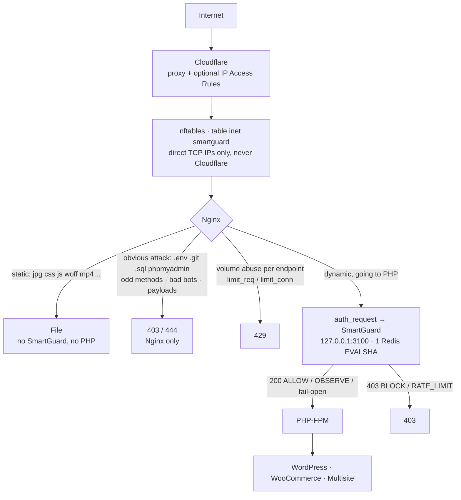
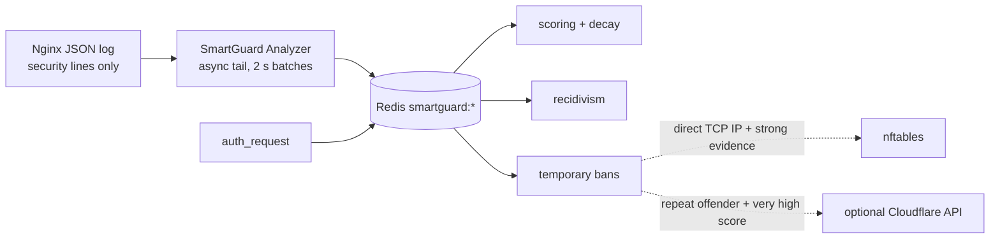

# SmartGuard

**English** · [Español](README.es.md)

Security layer for **WordPress, WooCommerce and WordPress Multisite** that stops malicious traffic
**before it consumes PHP-FPM**. Nginx stays as the front server; SmartGuard (NestJS + Redis) is the
decision, scoring, reputation and ban engine, and it is only asked about traffic that was going to PHP.

> Design priorities, in order: do not break WooCommerce · do not break Multisite · avoid PHP ·
> avoid false positives · low CPU · low Redis · fail-open · IPv4+IPv6 · maintainable · auditable.

- Install on a server, step by step: [section 4](#4-installation-and-first-steps) and
  [docs/02-PROCEDIMIENTOS.md](docs/02-PROCEDIMIENTOS.md) (Spanish)
- Install with Docker / Docker Compose: [docs/docker.md](docs/docker.md)
- All commands: [section 12](#12-commands)

---

## 1. Architecture





**Why `auth_request` only in the `location` blocks with `fastcgi_pass`:** it is the single point
through which *everything* that reaches PHP-FPM passes (including the internal redirects of
`try_files … /index.php`), and nothing static goes through it. No direct `.php` request can skip
SmartGuard and no image generates a subrequest.

## 2. Layout

```
smartguard/
├── src/
│   ├── main.ts / app.module.ts     Fastify bootstrap, global validation, ordered shutdown
│   ├── config/                     typed env + YAML (rules, sites, bots)
│   ├── common/                     types, IP/CIDR (IPv4/IPv6), URI, JSON logger, guards
│   ├── redis/                      connection + circuit breaker + Lua scripts
│   ├── reputation/                 Redis store and in-memory store (same semantics)
│   ├── rules/                      rule engine + anti-ReDoS protection
│   ├── scoring/                    decision, request context, AUDIT/ENFORCE mode
│   ├── ban/                        BanService (recidivism, nftables, Cloudflare)
│   ├── bots/                       FCrDNS verification (Googlebot, Bingbot, Applebot)
│   ├── whitelist/                  allowlists by type
│   ├── firewall/                   nftables without a shell (execFile + validation)
│   ├── cloudflare/                 Cloudflare ranges + optional API
│   ├── logs/                       JSON log tail + behaviour analyzer
│   ├── nginx/                      GET /internal/decision (auth_request), vhost editing
│   ├── admin/                      authenticated admin API
│   ├── dashboard/                  serves the Angular dashboard build (CSP + nonce)
│   ├── health/ metrics/ stats/ alerts/
├── config/          rules.yaml · sites.yaml · bots.yaml
├── nginx/           conf.d/smartguard.conf (→ sites-enabled/00-smartguard.conf on CloudPanel) · smartguard/*.conf
├── nftables/        smartguard.nft · origin-lock.nft
├── systemd/         smartguard.service (+ nftables drop-in) · smartguard-nft · Cloudflare ranges timer · reprotect watcher
├── scripts/         install · update · uninstall · rollback-nginx · update-cloudflare-ips ·
│                    origin-lock · test-attacks · loadtest · smartguard-fw-sync · lib/
├── docker/          Nginx image, site template and env example for Docker Compose
├── Dockerfile · docker-compose.yml
├── dashboard/       Angular 22 dashboard (standalone, signals, no zone.js), English/Spanish
├── bin/smartguard   CLI
├── logrotate/       smartguard-nginx
├── tests/           unit/ · integration/
└── docs/
```

## 3. Requirements

| Component | Version | Notes |
|---|---|---|
| Debian | 13 | tested on Debian 13 (Trixie) |
| Node.js | ≥ 22 | system-wide (`/usr/bin/node`), not nvm under `/home`. The `nodejs` package of Debian 13 is 20.x: the installer uses NodeSource |
| Nginx | ≥ 1.18 | with `http_auth_request_module` and `http_realip_module`. **Must already exist**, with the sites to protect |
| Redis | ≥ 6 | optional in practice: without Redis it works in memory (degraded mode) |
| nftables | any | optional |

The installer checks all of this and **installs what is missing** (curl, tar, openssl, git,
redis-tools, Node 22 and Redis), asking first. Nginx is the only thing it does not install.
With Docker none of this is needed on the host: see [docs/docker.md](docs/docker.md).

### Dependencies (and why each one)

| Package | Reason |
|---|---|
| `@nestjs/core`, `@nestjs/common`, `@nestjs/platform-fastify` | Requested framework; Fastify for lower overhead than Express on the decision endpoint |
| `reflect-metadata`, `rxjs` | Mandatory Nest dependencies |
| `ioredis` | Maintained Redis client, with `defineCommand` (automatic EVALSHA), pipelines, timeouts and backoff |
| `ipaddr.js` | Robust IPv4/IPv6/CIDR parsing (also used by Express); no dependencies |
| `yaml` | Rules and sites in readable YAML; no dependencies |
| `@prometheus-io/client` | Standard Prometheus metrics (correct histograms). It is the former `prom-client`, now maintained by the Prometheus project; same API. Requires Node ≥ 22 |

Not used: class-validator/class-transformer or DTO classes (validation is done with our own
decorators, see §10), dotenv (systemd `EnvironmentFile=`), axios (native fetch), `@nestjs/config`,
`@nestjs/schedule`, `@nestjs/throttler`, helmet (the API is local; the dashboard sets its security
headers and nonce-based CSP by hand), ORMs or SQL.

## 4. Installation and first steps

To run it with Docker Compose instead, go to [docs/docker.md](docs/docker.md).

### 4.1 Install

On the server, as a user with `sudo`:

```bash
sudo apt-get install -y git                       # only if git is missing
git clone https://github.com/piero2011/smartguard.git /tmp/smartguard-src
cd /tmp/smartguard-src
sudo ./scripts/install.sh --dry-run               # shows what it would do, changes nothing
sudo ./scripts/install.sh
```

What the installer does:

1. **Dependencies.** Anything the system lacks is installed with `apt`, asking first: `curl`, `tar`,
   `openssl`, `git`, `redis-tools`, **Node.js 22** (NodeSource) and **Redis**.
   - If the server already has a system Node older than 22, it warns that upgrading it affects every
     application using `/usr/bin/node` and only does it if you confirm. With `--yes` it does not
     upgrade: add `--upgrade-node`.
   - If there is only a per-user Node (nvm), it adds the system one without touching the other.
   - **Nginx is not installed**: SmartGuard protects sites already served by Nginx (or CloudPanel).
2. Full backup of `/etc/nginx`.
3. Installs the application in `/opt/smartguard`, the configuration in `/etc/smartguard` and the
   Nginx snippets in `/etc/nginx/smartguard`.
4. Starts the service in **AUDIT** mode: it logs what it would block, but blocks nothing.

`install.sh` options:

| Option | Effect |
|---|---|
| `--dry-run` | Shows every step without running it |
| `--yes` | Does not ask (except the Node upgrade, which requires `--upgrade-node`) |
| `--no-deps` | Does not install dependencies; only checks them |
| `--upgrade-node` | Allows upgrading an older system Node to version 22 |
| `--enable-nftables` | Also enables firewall blocking for direct connections |
| `--skip-realip` | Does not enable Cloudflare's real IP (if you already configure it yourself) |

The installer **does not modify any vhost**: until step 4.3, SmartGuard sees no traffic.

### 4.2 Allow your own IP

Before protecting anything, add the IP you administer from so you cannot block yourself:

```bash
sudo smartguard allow YOUR_IP ADMIN_ALLOWLIST "My IP"
sudo smartguard nginx-sync
```

### 4.3 Protect sites

```bash
sudo smartguard protect shop.com --dry-run        # shows the lines it would add to the vhost
sudo smartguard protect shop.com other.com
```

The name is the vhost file in `/etc/nginx/sites-enabled/` without `.conf`. The command inserts the
SmartGuard `include` lines in the right place, checks with `nginx -t` and reloads; if Nginx rejects
them, the vhost is left as it was. It can also be done from the dashboard (**IPs & sites** tab: tick
the sites and the dashboard gives you the command).

### 4.4 Open the dashboard

```bash
sudo grep '^ADMIN_TOKEN=' /etc/smartguard/smartguard.env | cut -d= -f2-     # the access token
ssh -L 3100:127.0.0.1:3100 user@server                                      # from your PC
```

and open `http://127.0.0.1:3100/dashboard/`. The dashboard only listens on the machine itself; to use
it with a domain, put an Nginx vhost with HTTPS in front that proxies to that port.

### 4.5 From AUDIT to ENFORCE

Let 24–72 hours pass in AUDIT and review what would have been blocked:

```bash
sudo smartguard report
```

If there is no legitimate traffic among what was flagged, enable real blocking:

```bash
sudo smartguard audit off          # ENFORCE.  To go back: sudo smartguard audit on
```

Full procedure and checks: [docs/02-PROCEDIMIENTOS.md](docs/02-PROCEDIMIENTOS.md) (Spanish).

## 5. Configuration

### 5.1 `/etc/smartguard/smartguard.env`

See [.env.example](.env.example) (commented). The most important settings:

| Variable | Default | What it does |
|---|---|---|
| `AUDIT_MODE` | `true` | Only logs `WOULD_*`; change it live with `smartguard audit off` |
| `ADMIN_ALLOWLIST` / `SERVICE_ALLOWLIST` / `TRUSTED_NETWORKS` | empty | IPs/CIDRs that are never banned (and exempt from the Nginx limits after `nginx-sync`) |
| `SCORE_OBSERVE/RATE_LIMIT/RESTRICT/BLOCK` | 20/40/60/80 | Response levels |
| `STRONG_EVIDENCE_MIN` | 40 | High-confidence evidence needed to ban a whole IP (NAT) |
| `SCORE_DECAY_PER_MINUTE` | 2 | Linear score decay |
| `BAN_FIRST…BAN_MAX` | 15m/1h/6h/24h/7d | Escalation for repeat offenders |
| `IPV6_PREFIX` | 64 | IPv6 grouping for reputation and bans |
| `REDIS_*` | 127.0.0.1:6379 db 0 | Use a different DB from the WordPress object cache |
| `ENABLE_NFTABLES` / `ENABLE_CLOUDFLARE` | false | Optional integrations |
| `LOCAL_NETWORKS` | empty | Networks accepted as local besides loopback. Only for Docker; leave empty otherwise |
| `UPDATE_REPO` / `UPDATE_BRANCH` | this repo / `main` | Where `smartguard update` downloads new versions from |

### 5.1b Allowlist and unblocking

| Value | Example | How it is checked | Where it applies |
|---|---|---|---|
| IP / CIDR | `203.0.113.36`, `2001:db8::/48` | in memory | SmartGuard + Nginx (limits) + nftables |
| Exact domain (client) | `app.customily.com` | resolved to its IPs every 10 min | SmartGuard + Nginx/nftables (IPs resolved on `nginx-sync`) |
| Subdomains (client) | `*.customily.com` | FCrDNS (PTR → domain → A/AAAA = same IP), only on suspicious signals, cached | SmartGuard only |
| Destination host | `api.example.com`, `*.dev.example.com` | host name of the request | SmartGuard does not score that site |

```bash
sudo smartguard allow 203.0.113.36                  # your IP (and unblocks it if it was banned)
sudo smartguard allow app.customily.com SERVICE_ALLOWLIST "Customily"
sudo smartguard allow '*.customily.com' SERVICE_ALLOWLIST
sudo smartguard allow-host api.example.com "Internal API"
sudo smartguard unallow '*.customily.com'
sudo smartguard allowlist
sudo smartguard lookup 203.0.113.36                 # which list is it in? blocked?
sudo smartguard nginx-sync                          # also exempts it from the Nginx limits
sudo smartguard unban 1.2.3.4                       # IP ban + fingerprints + nftables + Cloudflare + score reset
sudo smartguard unban 1.2.3.4 --keep-score          # only removes the ban
```

Static entries live in the `.env` (`ADMIN_ALLOWLIST`, `SERVICE_ALLOWLIST`, `TRUSTED_NETWORKS`,
`ALLOW_HOSTS`); dynamic ones are added by CLI/API/dashboard (Redis). A PTR alone proves nothing (the
owner of the IP controls it): that is why `*.domain` requires the forward resolution. For a vhost you
do not want to protect, the ideal is not to include the SmartGuard snippets in it; `allow-host` is for
when it shares configuration.

### 5.2 Rules (`rules.yaml`, `rules.d/*.yaml`, per-site overrides, dashboard)

Declarative rules (no `if` in the code). Example:

```yaml
- id: env-scan
  name: Attempt to read .env
  target: path            # path | query | uri | ua | method
  pattern: '(?:^|/)\.env(?:\.[\w.-]{1,30})?$'
  score: 25
  severity: high
  confidence: high        # low: IP+UA fingerprint only · medium: IP, never banned · high: strong evidence
  category: SENSITIVE_FILE
  action: score           # score | block (stops this request) | allow (exception)
  ttl: 86400
```

- Regexes are validated on load: no nested quantifiers, no alternations inside groups with `+`/`*`,
  no backreferences, ≤ 600 characters, and they are tested with adversarial inputs. An unsafe rule
  makes the reload fail and **the previous configuration stays active**.
- Your own rules go in `/etc/smartguard/rules.d/*.yaml` (update.sh does not touch them), or are
  created from the dashboard (**Rules** tab, stored in `/var/lib/smartguard/panel-rules.json`).
- `smartguard rules reload` reloads without restarting.

### 5.3 Sites (`sites.yaml`)

```yaml
sites:
  example.com:
    aliases: [www.example.com]
    multisite: true
    woocommerce: true
    xmlrpc: false
    rules:
      disabled: [wp-user-enum-author]
      overrides: { env-scan: { score: 30 } }
      extra: [ ...your own rules; same id = replaces the global one... ]
```

Hosts that are not configured → global rules, and the site is treated as `_unknown` internally (the
client's `Host` is never used as an internal key).

### 5.4 Bots (`bots.yaml`)

- **Verified by FCrDNS** (Google, Bing, Apple): IP → PTR → official domain → A/AAAA → same IP.
  The result is cached in memory and Redis (24 h positive / 6 h negative). **Never** synchronous DNS:
  the first request of a bot is treated as "not verified" (no privileges, no penalty) while it is
  verified in the background.
- **Fake** (Googlebot UA without verification): `fake-bot:google +15`.
- **Not verifiable by DNS** (DuckDuckBot, Meta/WhatsApp, Customily): no privileges in SmartGuard;
  Nginx keeps its current treatment (UA whitelist / `botzone`). For services with a fixed IP, use
  `SERVICE_ALLOWLIST`.
- **Unwanted** (Ahrefs, Semrush, MJ12, Baidu, Yandex…): Nginx already blocks them; SmartGuard adds
  points if they arrive some other way.

## 6. Nginx

| File | Context | Role |
|---|---|---|
| `conf.d/smartguard.conf` → installed as `conf.d/smartguard.conf` or, if nginx.conf only includes `sites-enabled/*.conf` (CloudPanel), as `sites-enabled/00-smartguard.conf` | http | includes everything below (definitions only) |
| `smartguard/cloudflare-realip.conf` | http | Cloudflare `set_real_ip_from` + `real_ip_header CF-Connecting-IP` (generated) |
| `smartguard/cloudflare-geo.conf` | http | `$sg_tcp_from_cloudflare` (generated) |
| `smartguard/maps.conf` | http | classification, limit keys, new Nginx rules, what gets logged |
| `smartguard/rate-limits.conf` | http | zones `sg_dynamic`, `sg_login`, `sg_xmlrpc`, `sg_ajax`, `sg_wcajax`, `sg_rest`, `sg_suspicious`, `sg_conn*` (**editable**) |
| `smartguard/mode.conf` · `limits-mode.conf` | http · server | AUDIT/ENFORCE and kill switch (generated by the CLI) |
| `smartguard/allowlist.conf` | http | `$sg_trusted` (generated by `nginx-sync`) |
| `smartguard/log-format.conf` | http | `log_format smartguard_json` without sensitive data |
| `smartguard/upstream.conf` | http | `smartguard_backend` with keepalive |
| `smartguard/server.conf` | server | new rules + `limit_req`/`limit_conn` + JSON log |
| `smartguard/auth.conf` | server | internal `auth_request` locations with **fail-open** |
| `smartguard/auth-php.conf` | location | `auth_request` (in every `location` with `fastcgi_pass`) |
| `smartguard/static-log.conf` | location | logs 4xx on static files (replaces `access_log off`) |
| `smartguard/secret.conf` | server | Nginx→SmartGuard shared secret (0600) |

Limits (anti-flood, high on purpose because of NAT/HTTP2/mobile):

| Zone | Key | Rate | Burst |
|---|---|---|---|
| `sg_dynamic` | IP, everything non-static | 30 r/s | 300 |
| `sg_login` | IP, `POST wp-login.php` | 10 r/min | 20 |
| `sg_ajax` | IP, `admin-ajax.php` | 20 r/s | 150 |
| `sg_wcajax` | IP, `?wc-ajax=` | 20 r/s | 150 |
| `sg_rest` | IP, `/wp-json/` and `?rest_route=` | 15 r/s | 150 |
| `sg_xmlrpc` | IP, `xmlrpc.php` | 2 r/min | 5 |
| `sg_suspicious` | IP, curl/python-requests/Go/empty UA | 5 r/s | 50 |
| `sg_conn` / `sg_conn_dynamic` | IP | 128 / 48 simultaneous | — |

**About 429 in `auth_request`:** Nginx `auth_request` only understands 2xx/401/403. SmartGuard
answers 429 for `RATE_LIMIT` (per the requested API), but `auth.conf` translates it to **403** for
the client. `error_page 403/429` is not used in the PHP `location` because a vhost with
`fastcgi_intercept_errors on` would replace WordPress's legitimate 401/403 (REST, nonces). The real
429s come from Nginx's `limit_req`.

## 7. Cloudflare

- **Real IP:** `$remote_addr` = visitor **only** if the TCP IP belongs to Cloudflare.
  `CF-Connecting-IP` on a direct connection is ignored. Check: docs/02, 13.6 point 4.
- **nftables never receives IPs from `CF-Connecting-IP`**: only TCP IPs of direct connections, and
  the Cloudflare ranges are protected in their own set.
- **Ranges:** `scripts/update-cloudflare-ips.sh` (weekly timer) downloads over HTTPS, validates every
  CIDR, aborts if the list looks suspicious, writes atomically, runs `nginx -t` before reloading and
  updates nftables in a single transaction.
- **Origin lock** (only Cloudflare + your IPs on 80/443): `scripts/origin-lock.sh check|enable|disable`.
  Do not enable it until `check` passes (every domain proxied, no services connecting directly).
- **Optional API:** IP Access Rules (account or zone) only for repeat offenders with a very high
  score, with deduplication, a maximum number of active rules, an hourly limit and automatic removal
  on expiry.

## 8. Redis

Every key has the `smartguard:` prefix and a **mandatory TTL** (details in
[src/reputation/redis.store.ts](src/reputation/redis.store.ts)):

| Key | Content | TTL |
|---|---|---|
| `ip:{ip}` | score, strong evidence, hit window, first/last seen | 1 h (renewable) |
| `fp:{hash}` | score of the IP+UA fingerprint | 30 min |
| `reasons:{ip}` | last 50 reasons | ≥ 24 h |
| `ban:{ip}` · `ban:fp:{hash}` · `auditban:*` | ban JSON | ban duration |
| `bans` · `auditbans` | ZSET index (listings without SCAN/KEYS) | cleaned on every insert |
| `recid:{ip}` | recidivism | 14 d |
| `dns:{bot}|{ip}` | FCrDNS result | 24 h / 6 h |
| `stats:{min}` · `hll:ips:{min}` · `top:*:{h}` | aggregated statistics (also per site) | 48 h |
| `events` | event stream | MAXLEN ~20 000 |

Cost per decision: **1 `EVALSHA`** (a pure read if the request has no signals: normal traffic creates
no keys). Statistics are aggregated in memory and flushed every 10 s in a pipeline. Circuit breaker:
5 errors in 10 s → 30 s using the in-memory store; `enableOfflineQueue=false` and a 60 ms timeout per
command; reconnection with exponential backoff up to 30 s.

Recommended: its own DB (`REDIS_DB`) or a dedicated instance with `maxmemory 128mb` +
`maxmemory-policy volatile-lru` (every SmartGuard key has a TTL).

## 9. Scoring and decisions

| Score | Action |
|---|---|
| 0–19 | ALLOW |
| 20–39 | OBSERVE (allowed, logged) |
| 40–59 | RATE_LIMIT (60 dynamic requests/min) |
| 60–79 | RESTRICTION (15/min) |
| ≥ 80 **and** strong evidence ≥ 40 | BLOCK + IP ban (15m → 1h → 6h → 24h → 7d) |
| ≥ 80 on the fingerprint only | BLOCK of IP+UA for 10 min (the rest of the NAT is unaffected) |

NAT protection: volume **never** adds points in SmartGuard; low-confidence signals only affect the
IP+User-Agent fingerprint; medium-confidence ones can limit but **never** ban a whole IP; the fast
scanning bonus only counts medium/high-confidence hits.

Every decision is explainable: `smartguard ip <IP>` or `GET /admin/ip/<IP>` shows reasons, decay and
action (example in docs/02, 14.1).

## 10. Security of SmartGuard itself

- Listens only on `127.0.0.1` (it fails to start if `BIND_ADDRESS` is not loopback).
- Every route rejects requests that do not come from loopback. In a Docker deployment the internal
  container network is declared in `LOCAL_NETWORKS` and accepted too; it must never be a public network.
- `/internal/decision` requires the secret shared with Nginx (prevents a local PHP/SSRF from poisoning
  IP reputation). Nginx forwards no cookies, Authorization or body.
- Admin API: `Authorization: Bearer ADMIN_TOKEN` (≥ 32 characters, constant-time comparison), rate
  limit, body ≤ 16 KB.
- Validation with **parameter decorators** (no DTOs or class-validator): `@ValidBody(schema)`,
  `@ValidQuery(schema)`, `@IpParam('ip')`, `@AllowValueParam('value')` in
  [src/common/validation.ts](src/common/validation.ts). Schemas are plain objects
  ([src/admin/admin.schemas.ts](src/admin/admin.schemas.ts)); undeclared fields → 400.
- systemd: `smartguard` user, no capabilities (only `CAP_NET_ADMIN` with the nftables drop-in),
  `ProtectSystem=strict`, `ProtectHome`, `NoNewPrivileges`, syscall filter, `MemoryMax`.
- nftables without a shell: `execFile("/usr/sbin/nft", argv)` with a canonical IP validated by allowlist.
- Logs without cookies/tokens/Authorization; redacted queries; the Nginx log stores no query strings.

## 11. Fail-open

| Failure | Result |
|---|---|
| SmartGuard stopped / not listening | `auth_request` → 502 → `@smartguard_failopen` (204) → normal PHP |
| SmartGuard slow (> 300 ms) | 504 → fail-open |
| Internal error in the decision | SmartGuard answers 200 `ERROR_FAIL_OPEN` |
| Redis down | Decisions with the local in-memory store (rules and local bans keep working) |
| Emergency | `smartguard killswitch on` (Nginx stops asking) |

The pure Nginx rules (bots, forbidden paths, limits) stay active in every case.

## 12. Commands

All of them run on the server with `sudo`. `sudo smartguard help` shows this list.

**Status and diagnosis**

| Command | What it does |
|---|---|
| `smartguard status` | Service, version, mode, Redis, blocks and traffic of the last hour |
| `smartguard version` | Installed version and commit |
| `smartguard ip <IP>` | Explains the score and state of an IP: why it was blocked |
| `smartguard lookup <value>` | Where an IP, CIDR, domain or URL is: which list, whether it is blocked |
| `smartguard events [N]` | Last N security events (30 by default) |
| `smartguard bans [--audit]` | Active blocks (or the ones AUDIT would have applied) |
| `smartguard report` | AUDIT report: what would have been blocked and possible false positives |
| `smartguard logs` | Live service log |

**Block and allow**

| Command | What it does |
|---|---|
| `smartguard ban <IP> [duration] [reason]` | Manual block (`15m`, `1h`, `2d`…; 1 h by default) |
| `smartguard unban <IP> [--keep-score]` | Removes the block and, by default, resets its score |
| `smartguard allow <value> [type] [note]` | Client allowlist: IP, CIDR, domain or `*.domain`. Type: `ADMIN_ALLOWLIST` (default), `SERVICE_ALLOWLIST`, `TRUSTED_NETWORK` |
| `smartguard allow-host <domain> [note]` | Exempts a destination site or subdomain (SmartGuard does not score its requests) |
| `smartguard unallow <value>` | Removes an allowlist entry |
| `smartguard allowlist` | Shows the full allowlist |
| `smartguard nginx-sync` | Pushes the allowlist to Nginx (exempt from limits) and regenerates the secret |

**Sites**

| Command | What it does |
|---|---|
| `smartguard protect <site>… [--dry-run] [--yes]` | Adds the protection to those sites by editing their vhost |
| `smartguard unprotect <site>… [--dry-run] [--yes]` | Removes it |
| `smartguard protected` | Sites registered with `protect` |
| `smartguard reprotect` | Restores the protection on registered sites that lost it (systemd runs it by itself when CloudPanel rewrites a vhost) |

**Mode and emergencies**

| Command | What it does |
|---|---|
| `smartguard audit status` | Current mode |
| `smartguard audit on` | AUDIT: only logs |
| `smartguard audit off` | ENFORCE: blocks |
| `smartguard killswitch on\|off` | Emergency: Nginx stops asking SmartGuard (the sites keep working) |
| `smartguard rules reload` | Reloads rules, sites and bots without restarting |
| `smartguard nginx-enable` | Re-enables SmartGuard in Nginx after `rollback-nginx.sh --disable` |
| `smartguard fw-sync` | Synchronizes the nftables sets |

**Maintenance**

| Command | What it does |
|---|---|
| `smartguard update [--check] [--force] [--yes]` | If there are changes on GitHub, downloads and installs them keeping the configuration |
| `smartguard backup [file.tar.gz]` | Full backup: configuration, Nginx snippets, Redis lists, protected vhosts and all of `/etc/nginx` |
| `smartguard restore <file> [--keep-env] [--yes]` | Restores a backup on this server |

The details of `update`, `backup`, `restore` and `protect` are in section 16. With Docker these
commands do not apply: see [docs/docker.md](docs/docker.md).

## 13. Local API

| Method | Path | Auth |
|---|---|---|
| GET | `/internal/decision` | Nginx secret |
| GET | `/health` · `/ready` · `/metrics` | loopback |
| GET | `/admin/bans?audit=&offset=&limit=` | token |
| GET | `/admin/ip/:ip` | token |
| POST | `/admin/ban` `{ip, duration?, reason?, firewall?, cloudflare?}` | token |
| DELETE | `/admin/ban/:ip` (`?reset=false` keeps the score) | token |
| GET | `/admin/lookup?value=` IP/CIDR/domain/*.domain/URL → lists it is in, ban, would-ban, score | token |
| GET | `/admin/allow` (static, dynamic, resolved domains) | token |
| POST | `/admin/allow` `{value, type?, target?: client|host, note?, ttl?, unban?}` | token |
| DELETE | `/admin/allow/:value` | token |
| GET | `/admin/ipinfo?ips=a,b,c` (up to 50) → network/ASN, organization, registration country, hosting? | token |
| GET | `/admin/blocked-networks` (whole networks blocked) | token |
| POST | `/admin/blocked-networks` `{ip? | asn?, note?}` — blocks every range of the ASN | token |
| DELETE | `/admin/blocked-networks?asn=` | token |
| GET | `/admin/blocked-bots` (bots blocked by name) | token |
| POST | `/admin/blocked-bots` `{pattern, note?, ttl?}` — text to look for in the User-Agent | token |
| DELETE | `/admin/blocked-bots?pattern=` | token |
| GET | `/admin/stats?minutes=&host=` (counters, series and tops; all sites or one) | token |
| GET | `/admin/events?limit=&from=&to=&ip=` (range in ms and IP: searches every stored event) | token |
| GET | `/admin/events/page?limit=&cursor=&kind=&host=&q=&from=&to=` (cursor pagination; used by the dashboard) | token |
| GET | `/admin/recent?host=&limit=` (recent traffic and active IPs, in memory) | token |
| GET | `/admin/sites` (Nginx sites and which ones are protected) | token |
| GET | `/admin/system` (version, disk, memory and Redis used by SmartGuard) | token |
| GET | `/admin/rules` (active rules) | token |
| GET/POST/DELETE | `/admin/panel-rules` (rules created from the dashboard, stored in `/var/lib/smartguard/panel-rules.json`) | token |
| POST | `/admin/rules/reload` | token |
| GET/POST | `/admin/mode` `{audit}` | token |
| GET | `/dashboard/` | loopback (data with token) |

**Errors with a code** (the dashboard translates them): `{ statusCode, code, message, params }`.

| code | When | params |
|---|---|---|
| `ALREADY_ALLOWLISTED` (409) | the value is already in the allowlist | `matches[]`: list, value, origin (.env / dashboard / built-in) |
| `ALREADY_COVERED` (409) | an existing range or `*.domain` already covers it | `matches[]` |
| `IP_ALLOWLISTED` (409) | trying to block an allowlisted IP | `matches[]` |
| `ALREADY_BANNED` (409) | the IP is already blocked | `ban` (until when, reason) |
| `CLOUDFLARE_IP` (400) | trying to block a Cloudflare IP | `ip` |
| `STATIC_ENTRY` (409) | trying to remove a .env entry through the API | `lists` |
| `RULE_REJECTED` · `RULE_TOO_BROAD` (400) · `RULE_ID_TAKEN` (409) | a dashboard rule is unsafe, also matches normal traffic, or reuses a built-in id | `error`, `sample`, `id` |
| `NOT_IN_ALLOWLIST` (404) · `INVALID_IP` · `INVALID_VALUE` · `HOST_REQUIRES_DOMAIN` · `VALIDATION` (400) | — | `field`, `reason` |

## 13b. Dashboard (Angular, English / Español)

- **Angular 22** standalone + signals, no zone.js or UI libraries.
- **Default language: English**; English/Español selector in the header (remembered in the browser).
  Every message, including backend errors, is translated by its `code`.
- Tabs: **Overview · Traffic · IPs & sites · Rules · Blocked · Allowlist · Events · Backup**.
  - **Overview**: chart of requests allowed, blocked by SmartGuard and stopped by Nginx rules (1 h,
    6 h or 24 h), counters, the "top" IPs, paths and rules, and what SmartGuard uses on the server
    (version, memory, disk, Redis).
  - **Traffic**: IPs active in the last 5 minutes and the latest evaluated requests, allowed ones
    included. Kept in memory only (300 per site).
  - **IPs & sites**: check, allow and block; list of Nginx sites with their protection status, a
    search box, and checkboxes to get the `smartguard protect` command.
  - **Rules**: create, edit, disable and delete your own rules (stored in
    `/var/lib/smartguard/panel-rules.json`, applied at once); the built-in ones are read-only. A rule
    that would also match normal traffic, has an unsafe regex or reuses a built-in id is rejected.
  - **Blocked** and **Allowlist**: what is blocked (IPs, networks, bots) and what is allowed.
  - **Events**: suspicious or blocked requests, with filters by type, text and dates; 50 per page.
  - **Backup**: export to a file and import what the dashboard manages (rules, allowlist, manual
    blocks, bots and networks). The full server backup is `smartguard backup`.
- A **Site** selector, with search, limits Overview, Traffic and Events to one protected site (with
  all its domains) or shows them all. The tab, the site and the time range are kept in the URL:
  reloading the page leaves you where you were.
- Light or dark theme following the operating system, with a button to pin one.
- In **IPs & sites**:
  - *Check*: type an IP, CIDR, domain, `*.domain` or URL and it tells you at once whether **it is
    already in a list and which one** (Admin IPs / Services / Trusted networks / Exempt sites, origin
    .env or dashboard, and why it matches: exact, inside a range, IP of a domain…), whether it is
    blocked and until when, and its score.
  - *Allow a client*: IP / CIDR / domain / `*.domain` in the chosen list (allowing an IP unblocks it).
  - *Allow a site or subdomain*: domain, `*.domain` or URL (`https://api.example.com/path` → `api.example.com`).
  - *Block an IP* (15 min … 1 year) and *Unblock an IP* (optionally keeping the score).
  - If the value was already there, the notice shows the list (the backend validates it too: 409).
- In **Events** and **Traffic**, every row has *Block IP* and *Block bot* (by name: it suggests the
  bot's own name from the User-Agent). The list of blocked bots is managed in **Blocked**.
- *Block network* blocks **the whole network** of that IP: every range announced by its ASN (e.g. the
  ~900 of DigitalOcean), downloaded from RIPEstat and refreshed daily. Membership is checked in memory
  by binary search, with no I/O in the decision. Cloudflare cannot be blocked. Meant for hosting
  providers; on an internet carrier it would block real customers.
- Manual IP, bot and network blocks **do not expire**: they last until unblocked in **Blocked**.
- **Manual blocks (IP, bot or network) always apply, also in AUDIT**: AUDIT only suspends what
  SmartGuard decides by itself. They never block allowlisted IPs or verified search engines, and texts
  that also cover real browsers (`chrome`, `mozilla`…) are rejected. They act on what goes to PHP
  (auth_request); static files do not pass through SmartGuard.
- Under each IP you see **who it belongs to**: country and organization of the network (e.g.
  `US · DigitalOcean, LLC`) and the *data center* tag if it is a hosting provider (servers, not
  people). Source: Team Cymru's IP→ASN over DNS, cached for 24 h; only queried when a table is
  opened, never when deciding. The country is the **registration country of the network**, not exact
  geolocation. The *Country* column uses `CF-IPCountry` when present (Cloudflare → Network → IP
  Geolocation) and, otherwise, that registration country.
- Security: loopback only, token in `sessionStorage`, CSP `script-src 'self'` and styles with a
  per-request nonce, no inline scripts.

Access: `ssh -L 3100:127.0.0.1:3100 user@vps` and open `http://127.0.0.1:3100/dashboard/`
(the token is the `ADMIN_TOKEN` of `/etc/smartguard/smartguard.env`).

Build: `npm run build:dashboard` (or `cd dashboard && npm ci && npx ng build`). `install.sh`/`update.sh`
use the build included in `dashboard/dist/browser` or compile it. Development:
`cd dashboard && npx ng serve --proxy-config proxy.conf.json` (with SmartGuard on 127.0.0.1:3100).

## 14. Tests

```bash
npm ci
npm test                         # unit + HTTP integration (no Redis)
# Lua against a real Redis (on the server, test DB):
SMARTGUARD_TEST_REDIS=1 REDIS_DB=15 npx jest tests/integration/redis-lua
```

Covers: normal visitor, NAT with 500 requests, WooCommerce `wc-ajax`, `admin-ajax`, Multisite
`/site1/wp-admin/`, scanner (.env/.git/shell/phpinfo/phpunit), recidivism, AUDIT, IPv6 /64,
fingerprint vs IP (NAT), fake Googlebot (incl. forged PTR), real Googlebot (IPv4/IPv6), allowlist,
`action: block`, decay, Redis down (fail-open), credential stuffing, successful logins, analyzer/decision
double counting, plugin enumeration, anti-ReDoS, every rule of the repo against legitimate paths, admin
API, decorator validation, allowlist by domain/subdomain/host, full unblock, live mode change, dashboard
CSP, per-site statistics, vhost editing, dashboard rules and backup export/import.

Tests on the server: `scripts/test-attacks.sh` (safe, documentation IPs) and `scripts/loadtest.sh`
(baseline vs SmartGuard).

## 15. Troubleshooting

| Symptom | Check |
|---|---|
| `nginx -t` fails after installing | `nginx -T | grep -n smartguard`; duplicated realip? → reinstall with `--skip-realip` |
| All traffic shows Cloudflare's IP | realip not active: `nginx -T | grep real_ip` |
| `x-smartguard-decision: UNAUTHENTICATED` in logs | `sudo smartguard nginx-sync` (secret out of sync) |
| SmartGuard does not start | `journalctl -u smartguard -n 80 --no-pager` (short ADMIN_TOKEN, invalid YAML, Node under /home) |
| Dashboard/CLI 401 | `ADMIN_TOKEN` of the .env; CLI with `sudo` |
| `degraded: true` | Redis down or wrong `REDIS_PASSWORD`/`REDIS_DB` |
| A legitimate customer is blocked | `sudo smartguard ip <IP>` → `unban` → allowlist or adjust the rule |
| Analyzer without data | `ls -l /var/log/nginx/smartguard/`; `id smartguard` (group adm) |

## 16. Rollback, update and uninstall

```bash
sudo /opt/smartguard/scripts/rollback-nginx.sh --disable      # neutralizes SmartGuard in Nginx (reversible)
sudo smartguard nginx-enable                                  # undoes the above
sudo /opt/smartguard/scripts/rollback-nginx.sh --list
sudo /opt/smartguard/scripts/rollback-nginx.sh --restore /etc/nginx/backups/nginx-….tar.gz
sudo smartguard protect shop.com other.com                    # adds the protection to those sites (edits the vhost, nginx -t, reload)
sudo smartguard protect shop.com --dry-run                    # only shows which lines it would add
sudo smartguard unprotect shop.com                            # removes the SmartGuard includes from that site
sudo smartguard protected                                     # sites registered with "protect"
sudo smartguard backup                                        # full backup in /root/smartguard-backup-….tar.gz
sudo smartguard restore /root/smartguard-backup-….tar.gz      # restores it on this server (--keep-env: keeps its .env)
sudo smartguard update                                        # if there are changes on GitHub, downloads and installs them
sudo smartguard update --check                                # only says whether there is a new version
cd new-version && sudo ./scripts/update.sh                    # the same by hand, from an already downloaded copy
sudo /opt/smartguard/scripts/update.sh --revert
sudo /opt/smartguard/scripts/uninstall.sh [--purge]
```

`smartguard backup` packs `/etc/smartguard`, `/etc/nginx/smartguard`, the lists kept in Redis (dynamic
allowlist, manual IP blocks, blocked bots and networks, dashboard rules), the protected vhosts and a
copy of all of `/etc/nginx`. `smartguard restore` applies configuration, snippets and lists (with
`nginx -t` and rollback if anything fails) and restores the protection on the registered sites; it does
**not** overwrite `/etc/nginx` as a whole: the vhosts and `nginx-full.tar.gz` travel in the backup as a
reference. To move to another server: install SmartGuard there (`install.sh`), copy the file and run
`restore`.

Sites added with `smartguard protect` are recorded in `/etc/smartguard/protected-sites`. CloudPanel
keeps its own copy of each vhost and rewrites the whole file when it is saved from its panel, which
drops the includes: `smartguard-reprotect.path` watches `/etc/nginx/sites-enabled` and, as soon as
something changes, `smartguard reprotect` puts them back in the registered sites (with `nginx -t`; if
Nginx rejects them it leaves the vhost as it was and does not retry until the vhost changes again). To
stop protecting a site use `smartguard unprotect`; do not delete the lines by hand.

`smartguard update` compares the installed commit (`/opt/smartguard/COMMIT`) with the `UPDATE_BRANCH`
branch of `UPDATE_REPO`. If they match it does nothing; otherwise it downloads to `/opt/smartguard-src`
and runs `update.sh`, which keeps `.env`, rules, sites and allowlists and goes back by itself if the
new version does not start.

## 17. Roadmap

- **V1 (this repository):** Nginx hardening, Cloudflare real IP, Redis, scoring + rules,
  AUDIT/ENFORCE, bans with recidivism, log analyzer, fail-open `auth_request`, systemd, CLI, tests.
  Also included (safe and optional): nftables, origin-lock, Cloudflare API, dashboard, Prometheus
  metrics, webhook alerts, Docker Compose stack.
- **V2:** Unix socket for the API; Nginx geo with the official Googlebot/Bingbot ranges
  (googlebot.json, bingbot.json) to verify without DNS; optional WordPress mu-plugin reporting failed
  logins (user hash, no passwords) to detect "many usernames"; Telegram/email alerts; optional history
  in PostgreSQL (asynchronous, off the critical path).
- **V3:** statistical detection (baselines per endpoint/hour, per-site anomalies), an interface for
  ML models off the critical path.

## 18. Known limitations (honest)

- The Nginx configuration and bash scripts were developed on Windows: `bash -n` passes, and the
  installer validates everything with `nginx -t` before reloading and reverts if it fails. Run
  `install.sh --dry-run` first.
- The Docker images and the Compose stack were written without a Docker engine at hand: the
  container start script and the service were tested separately, but `docker compose up` was not.
  See the checklist in [docs/docker.md](docs/docker.md).
- The Lua script was verified in a Lua VM with a simulated `redis.call` against the in-memory
  implementation (identical results). Confirm it on the server with the `redis-lua` test (section 14).
- SmartGuard's `RATE_LIMIT` reaches the client as 403 (an `auth_request` limitation, see section 6).
- Without the request body (privacy), distinct usernames in wp-login are not counted; credential
  stuffing is detected by the volume of failed logins (POST 200) per IP and per fingerprint.
- GeoIP: only as context from `CF-IPCountry` when the connection comes through Cloudflare; countries
  are not blocked.
- If the `CF-IPCountry` header does not arrive (site without the proxy), there is no country.
